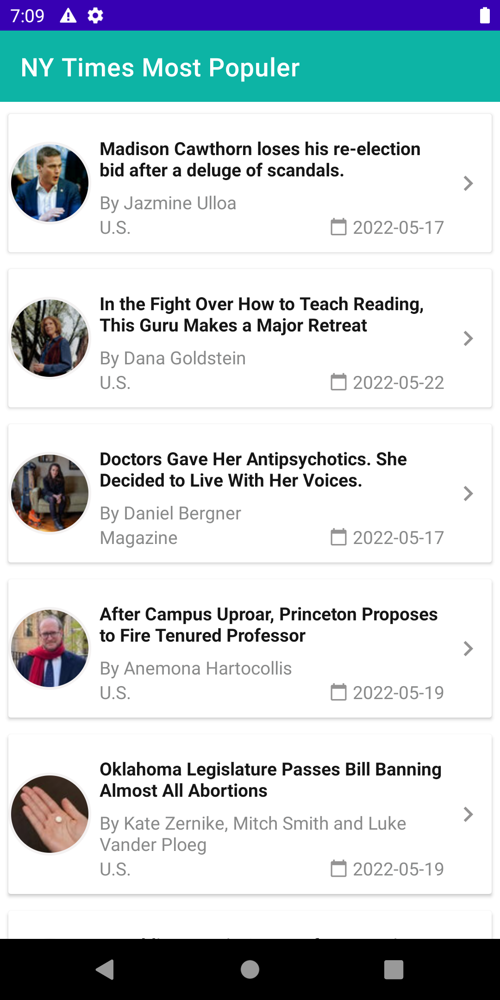

A simple app to hit the NY Times Most Popular Articles API and show a list of articles, that shows details when items on the list item is tapped and implement MVVM architecture using Koin, Retrofit, Coroutines, LiveData, DataBinding and Navigation Component.

API used - https://api.nytimes.com/

<br>
<p align="center">
    
    
</p>
<br>
## This Project showcases :
1. MVVM architecture.
2. Room Database.
3. Retrofit.
4. Glide.
5. Navigation.
6. DataBinding.
7. Kotlin Coroutines.
8. Notification.
<br>

## The app has following packages:
1. **model**: request response classes mention here.
2. **di**: Dependency mention here.
4. **ui**: View classes.
5. **utils**: Utility classes.
<br>

## If you see java 11 error then do following steps
1. **Go to Files**
2. **Settings**
4. **Build,Execution,Deployment**
5. **Build Tool**
6. **Select Gradle JDK to Java 11**
<br>

## License
```
   Copyright (C) 2022 Namdev Londhe

   Licensed under the Apache License, Version 2.0 (the "License");
   you may not use this file except in compliance with the License.
   You may obtain a copy of the License at

       http://www.apache.org/licenses/LICENSE-2.0

   Unless required by applicable law or agreed to in writing, software
   distributed under the License is distributed on an "AS IS" BASIS,
   WITHOUT WARRANTIES OR CONDITIONS OF ANY KIND, either express or implied.
   See the License for the specific language governing permissions and
   limitations under the License.
